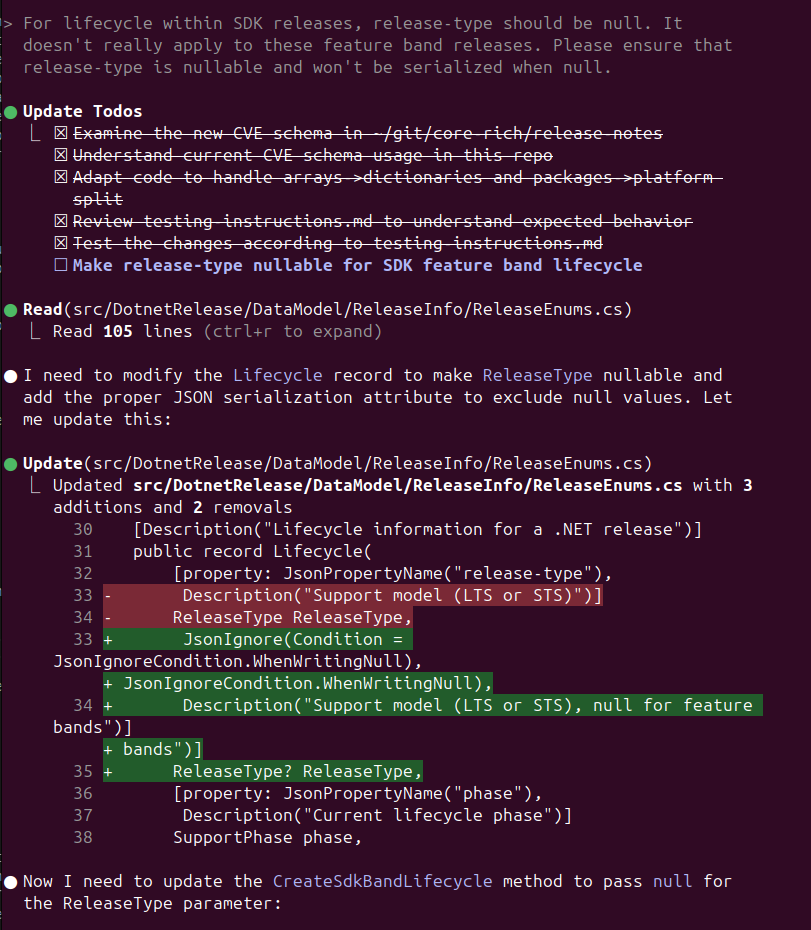
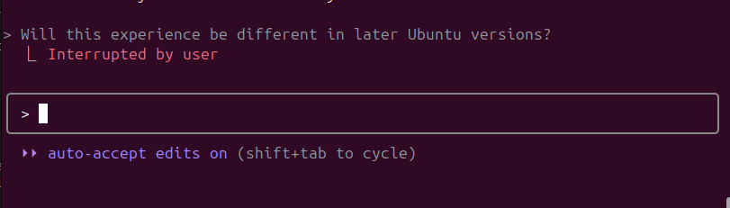
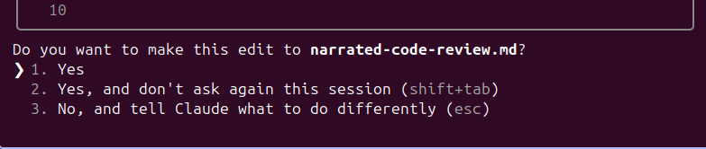

# Narrated Code Review Beats Autonomy with Human in the Loop

> "The biggest lesson that can be read from AI coding tools is that general
   methods that leverage human comprehension are ultimately what matter for
   production code. The autonomous-generation approach tends to complicate
   workflows in ways that make them less suited to taking advantage of human
   review capabilities."

I've been using Claude Code (CC) extensively. It seems to be a crowd favourite. Why? It's because at its core, CC is a code review product that one can argue is optimized for "time to merged PR". The strength of CC is that it takes its users through a narrated journey that ends in high understanding of the code diff ultimately presented via a GitHub PR. The CLI form factor likely forced the CC team in this direction, however, the form factor itself does not offer any inherent advantage (other than constraint).

This narrated approach represents just one of many coding modalities available today. I also use SAAS Autonomous Agent modes from Copilot and Cursor, which operate on the opposite end of the spectrum—they prioritize speed and independence over collaboration. You can even use CC in "yolo mode" for quicker hands-off execution. A single modality isn't going to dominate, even within the context of a single person. Sophisticated users will leverage multiple approaches daily, choosing the right tool for each situation while gravitating toward one primary mode for high-value projects.

The key difference lies in how these tools orchestrate the handoff between AI and human review. Most other AI coding tools create a cold-start problem, to differing degrees. You get code you didn't write and have to review it out-of-context.

## The context advantage

There is a lot of discussion about autonomous agents and human in the loop. There is also discussion on how developers are responsible for the code they merge into production. The question is how all of that is coherent together and how the current products on the market are resolving the inherent conflicts between autonomy and responsibility. It seems like we're not going to fire the AI, so how do we best prepare that human for success?

Consider how stock traders operate: successful traders don't just review end-of-day P&L reports. They live through the market action—watching the tape, following order flow, absorbing news and commentary as events unfold. When they evaluate their positions later, they have the full narrative context of how they got there. They remember the reasoning behind each trade because they experienced it happening.

Similarly, CC ensures you're not reviewing code changes cold. You've followed along as Claude reasoned through the problem, watched the diffs emerge, and understood the decision points. The diffs use the familiar `git diff` format with line numbers that anchor you to exact locations in the codebase. When you reach the final PR review, you're seeing the same diff format you've already processed during development—the code feels familiar rather than foreign.

The editor solutions are (so far) presenting an unchanged UI paradigm. A chat window has been added, but it is fundamentally just another window that could equally have been used for viewing cloud resources. Perhaps there is an opportunity to offer a more ambitious paradigm within the editor modality.

## Bitter Lesson

While autonomous agents might generate code slightly faster in isolation, they create a review bottleneck that can dramatically extend overall cycle time. A developer facing an unfamiliar 200-line diff from an autonomous agent might spend 20-30 minutes understanding the changes, questioning the approach, and testing edge cases. With CC's narrated approach, that same developer already understands the reasoning and can approve the PR in minutes.

The bitter lesson is that code review is the only experience that will really matter. The LLMs will scale code generation on availability of power and other raw resources—they'll get faster, smarter, and more capable with each hardware generation and model improvement. The AI industry obsesses over expanding context windows from 8K to 128K to 1M tokens, solving the machine's memory limitations through silicon and engineering. But the human ability to improve code review is fundamentally more constrained. Evolution doesn't work at the speed of silicon node shrinks. We can't significantly increase our reading comprehension speed, our ability to hold complex mental models, or our capacity to spot edge cases through sheer computational scaling.

This asymmetry means that while AI coding tools compete on generation capabilities, the real competitive advantage lies in optimizing the human review experience. The tools that help developers understand, evaluate, and confidently approve changes will win the long game. It's not about generating more code faster—it's about generating code that humans can review faster and with greater confidence.

## One‑Pane Narration UI

I think of CC as a "One‑Pane Narration UI". The CLI doesn't naturally allow for splitting navigation from content, from chat. It is forcing a unified treatment, with content going upwards into a buffer as new content replaces it from the top. Finally! We have a doom-scroller for coding!

In a typical CC flow, we see:

- Prompt
- Reasoning
- Code diff
- Status

Here's a simple example.

This view demonstrates how different this is from the editor workflow. Editors present an inherent separation between chat and code. In fact (shocker), editors only show one file at once, but can edit multiple at the same time (or least faster than most humans can reason).

## Not rude to interrupt

The escape key can be pressed at any time to stop CC. The level of effort for this is very low. In fact, the choice of this key is no accident, as it the most well-placed key on the keyboard for this purpose. This means that if I am even slightly confused or think CC is even 10% off (or whatever my threshold is), I hit escape and then we have a wee chat to steer things back on track. It's much easier than interupting some of my colleagues.

There is the "human in the loop" term. I think of that as a human being able to take the steering wheel in a self-driving EV.

The intent is for the user to have every opportunity to steer CC in a favorable direction. It's literally got all day.

All the editor experiences I've tried are much more awkward to interrupt and seem to require using the mouse as the steering wheel.

## Modality fusion

I propose that the winner will be the vendor who can deliver the narrated code review experience across all form factors—CLI, editor, web, mobile. This mirrors how VS Code dominated the market: one consistent interface paradigm deployed everywhere (vscode.dev, github.dev, codespaces, desktop app). Microsoft didn't just build a good editor; they made that editor available wherever developers needed it.

The same opportunity exists for AI coding tools. The narrated, one-pane experience shouldn't be limited to the CLI. Imagine opening your editor and having a full-width "Claude Workspace" pane (pinned leftmost for easy access) that provides the same prompt → reasoning → diff → status flow. No narrow chat window, no file switching interruptions while the assistant is working. The AI narrates its changes in real-time, you follow along, and when it's done you already understand what happened. This focused UI design would also enable efficient desktop tiling—just like terminals, you could pack multiple AI coding sessions onto a single monitor, switching attention between them as needed.

The technical implementation might vary between a CLI and a client or web app but the core experience should be identical: narrated code review that eliminates the cold-start problem. Developers could start a feature in the CLI during deep work, continue it in the editor when they need visual debugging, and review the final PR on mobile, all while maintaining that narrative thread of understanding.

## Closing

I commonly have multiple full-length terminals open on my single 4k monitor working on different features simultaneously. I'm operating them a bit like a CNC mill operator—monitoring multiple automated processes, ready to intervene when needed. While one Claude instance burns through tokens on a complex refactor, I can focus on another that's showing me diffs and reasoning through a different feature. My attention flows to whichever process needs human input, while the others work autonomously in the background.

This is what I have in mind for the future of AI-human collaboration: not autonomy vs. human-in-the-loop, but orchestrated workflows that optimize for human understanding. The tools that help developers stay connected to the code they're responsible for—through narration, familiar formats, and easy interruption—will ultimately deliver better outcomes than those that prioritize raw generation speed at the expense of human comprehension.
